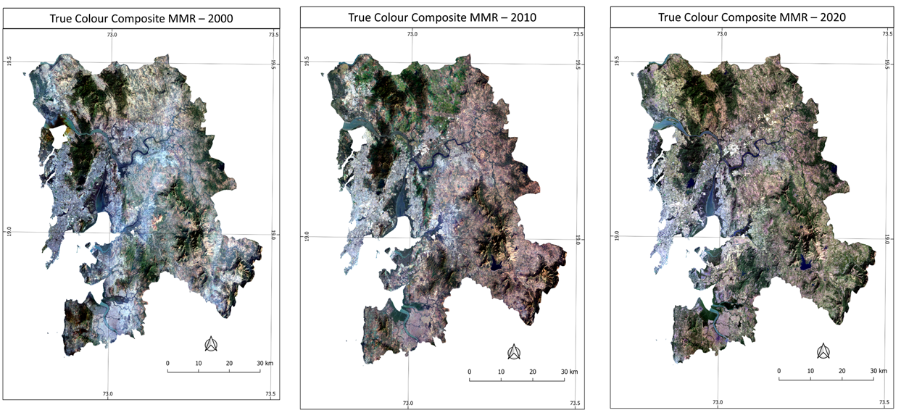
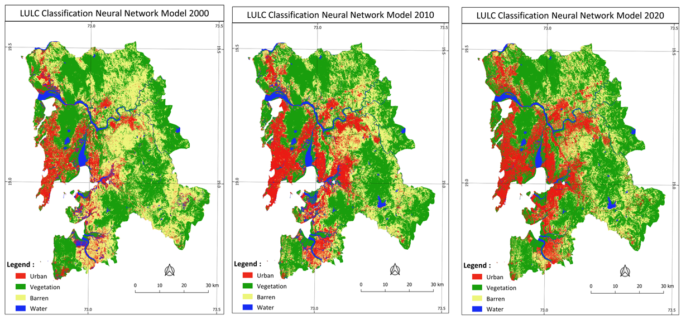
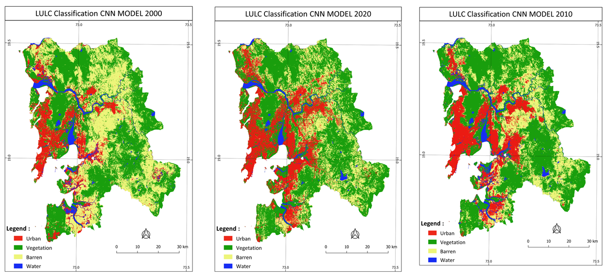

# Landuse Landcover Classification

## Data Used 
Add data specifications of landsat 5 and landsat 8. (resolution, number of bands, radiometric resolution, swath)

## Methodology 
The study aims to identifying landuse landcover (LULC) change across MMR region. The LULC classification is accomplished using Landsat Multispectral data. The Landsat series satellites provides continues data across the globe. The Landsat data is best suitable for LULC monitoring and change detection at regional scale.  The presence of clouds and the cloud shadow are problems with multispectral satellites. This can be solved using taking a 25th percentile of satellite imagery with a sufficient number of observations. To implement 25th percentile mosaic algorithm google earth engine (GEE) platform is used. The winter season data (January to February) of landsat 5 for year 2000 and year 2010 and landsat 8 for year 2020 is input parameter for 25th percentile algorithm. 
Neural network model training requires labelled data. The labelled Ground truth training samples are collected using supervised classification and corrected using image interpretations technique. Model has input data  as satellite imagery and corresponding LULC class. The trained model used to predict LULC for MMR region. 

## Results 

- True Colour Composite 

- Neural Network Classification Results 

- Convolution Neural Network Classification Results

